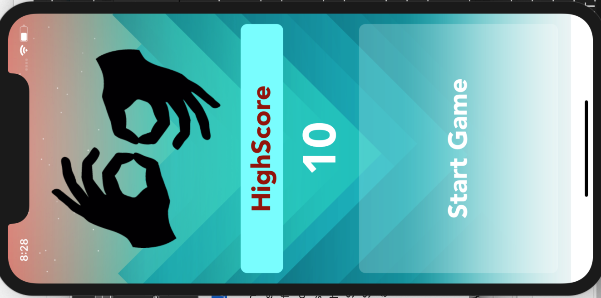

# TITLE - Bop It IOS Game

IOS App simulating the original [Bop-It-Game](https://en.wikipedia.org/wiki/Bop_It) ideas using [UIGestureRecognizer](https://developer.apple.com/documentation/uikit/uigesturerecognizer) class.

## Getting Started

These instructions will get you a copy of the project up and running on your local machine for development and testing purposes. See deployment for notes on how to deploy the project on a live system.

### Prerequisites

XCODE (software)
MAC OSX(operating system)
Simulator (software for testing purposes)

### Installing

1. "cd" to your local repository and perform the following commands
 - git clone https://github.com/iamsean007/Bop-IT-IOS-App.git

## Deployment

Open "BOP IT.xcodeproj" file in Xcode
Build and then run the project

## Built With

* [Xcode](https://developer.apple.com/xcode/) 
* [swift Language](https://developer.apple.com/swift/)

## Authors

* **Shivam Mahendru** - *Initial work* - [Shivam Mahendru](https://github.com/iamsean007/)

## License

This project is licensed under the MIT License - see the [LICENSE.md](LICENSE.md) file for details
